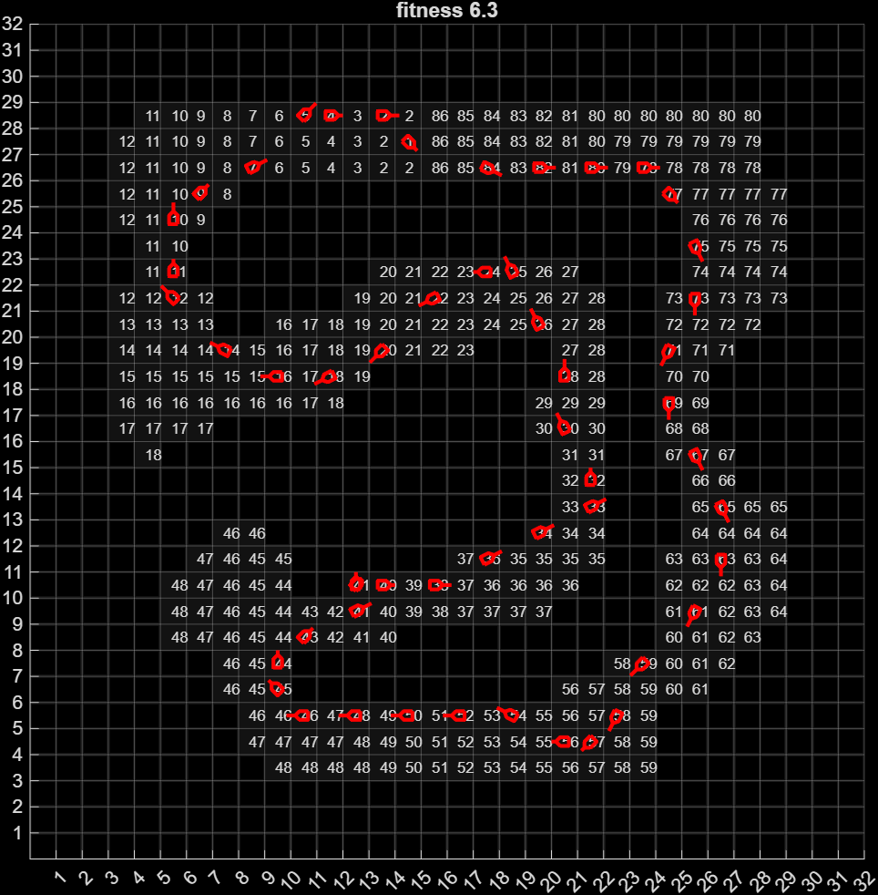
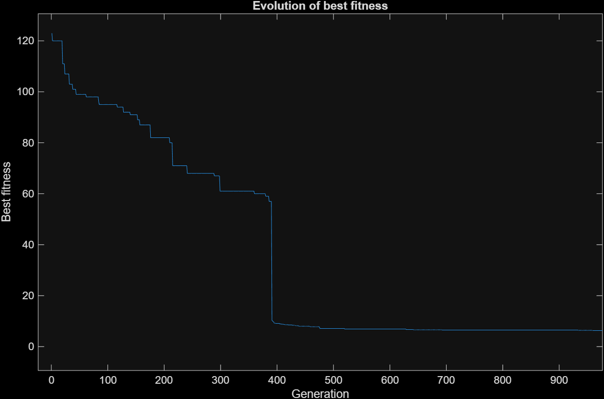
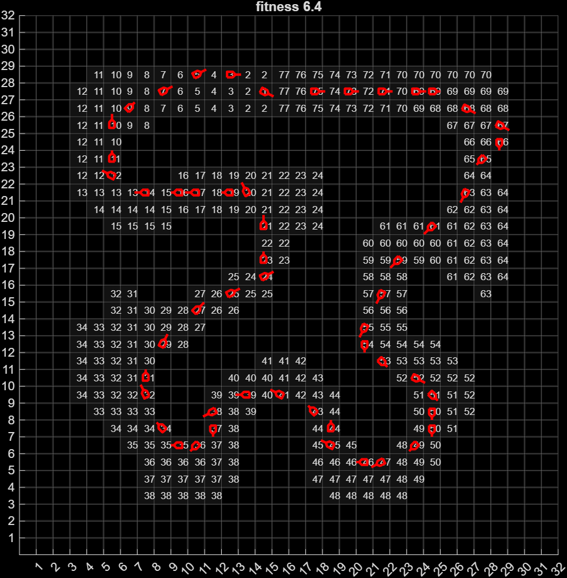
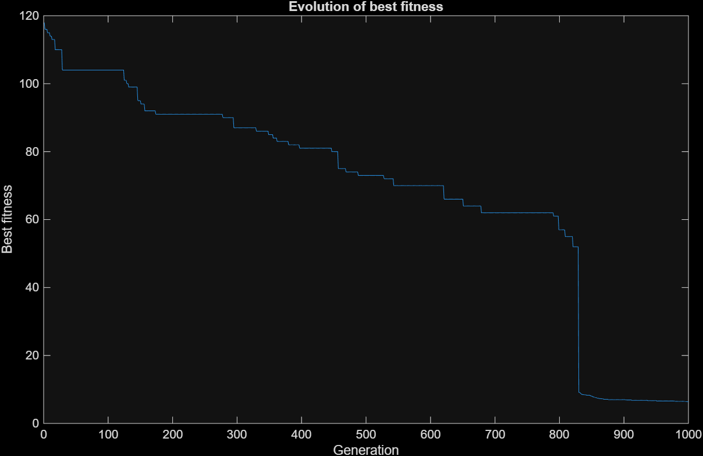

# Report on the Project "Genetic Algorithm for Virtual Car Racing"

**Author:** Gintaras Glaudialis, Eliott Menard

## Introduction

This project implements a genetic algorithm (GA) designed to train a virtual car to navigate racing tracks as efficiently as possible. The main goal is to demonstrate the application of GA in a control-optimization task, where an agent (the car) must learn how to drive along a track based on parameters that evolve across generations.

The project is structured around MATLAB code, including:

* `main.m` — the central script that launches and manages the GA;
* `show_results.m` — visualization of training outcomes;
* `src/*` — custom implementations of the genetic operators and fitness evaluation;
* `thirdparty/*` — provided external code for track simulation and supporting mechanics.

Two different tracks were used to compute and compare results.

---

## Problem Statement

The task is to optimize the control strategy of a car driving along a predefined racing track. The car's behavior is determined by a sequence of control parameters encoded in a chromosome. The objective is to maximize the distance the car travels or achieve efficient completion of the track while avoiding collisions with boundaries.

The genetic algorithm employs the following mechanisms:

* **Solution Encoding** — control parameters are encoded as a sequence of genes;
* **Fitness Function** — evaluates how successfully each individual navigates the track;
* **Selection** — the best-performing individuals are chosen for reproduction;
* **Crossover** — combination of genetic material from two parents to form offspring;
* **Mutation** — random perturbations to prevent premature convergence.

---

## Project Structure

### Main Files

#### `main.m`

Manages the full GA workflow:

1. Initialization of GA parameters.
2. Loading of the track and car model.
3. Execution of the evolutionary loop:

   * simulation of all individuals;
   * computation of fitness values;
   * selection, crossover, mutation;
4. Saving results.

#### `show_results.m`

Used to visualize:

* the trajectory of the best-performing individual;
* fitness progression over generations;
* comparison of results between the two tracks.

#### `src/*`

Contains custom implementations of:

* the fitness evaluation function;
* simulation loops;
* structure of output data.

#### `thirdparty/*`

Provided external code that includes:

* mutation and crossover functions;
* track visualization tools;
* basic physics engine;
* supporting utilities.

---

## Algorithm Workflow

1. **Population Initialization** — random generation of control strategies.
2. **Simulation** — each individual's car attempts to drive along the track.
3. **Evaluation** — individuals are scored based on performance.
4. **Selection** — high-scoring individuals are retained.
5. **Crossover** — new individuals are generated.
6. **Mutation** — randomness is introduced.
7. **Iteration** — steps repeat for a defined number of generations.
8. **Saving and Visualization** — best results are stored and displayed.

---

## Results

Calculations were conducted on two racing tracks.

### Track 1

### Track 2

---

## Analysis of Results

* The genetic algorithm successfully learned to navigate both tracks.
* Track 1 showed faster convergence due to a simpler layout.
* Track 2 required more generations to achieve competitive performance, likely due to more complex sections.
* Mutation played an important role in avoiding local minima and improving coverage of the solution space.

---

## Conclusion

This project demonstrates the effectiveness of genetic algorithms for learning control strategies in dynamic environments. The implemented architecture allows for easy modification of GA parameters, addition of new tracks, and expansion with more complex features.

Potential directions for future development include:

* replacing fixed control parameters with neural network-based controllers;
* applying advanced selection strategies or adaptive mutation rates;
* introducing additional fitness metrics such as smoothness of steering or fuel efficiency.
